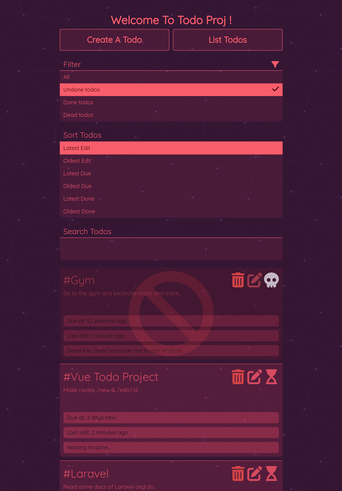
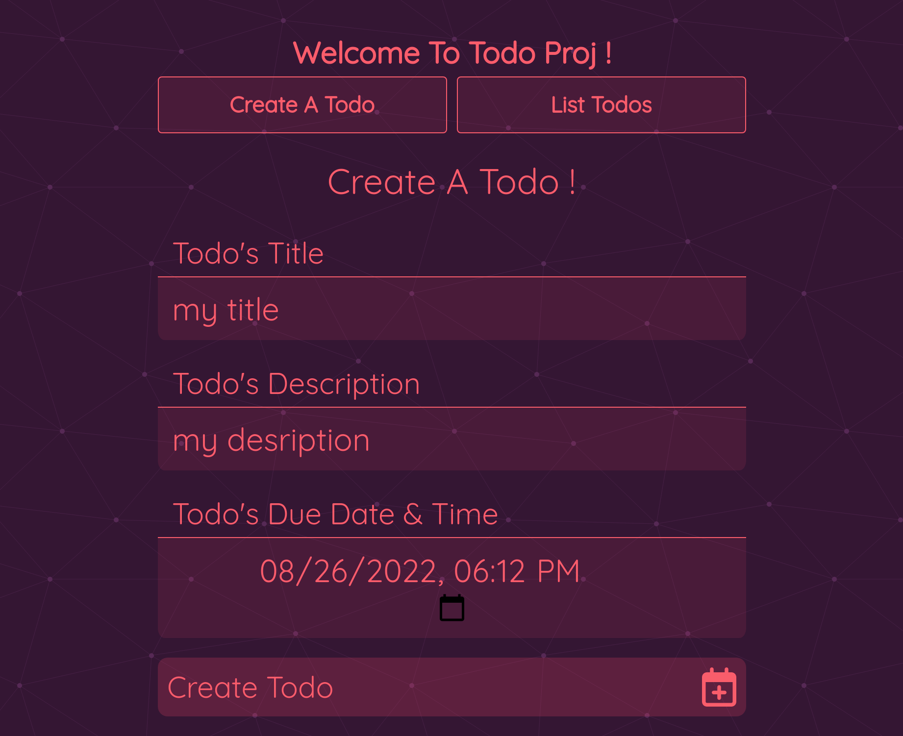

# In the name of kindly generous ALLAH
# Thanks ALLAH


## Todo
It is a bit similar to [another project](https://github.com/abol313/Ighamat24-training/tree/master/todo_react_js) in React, but the time spent is more on it and it has many more features such as dead and banned todos... and some less...

## Vue
The framework of Js that i used is Vue
## My [@abol313](https://github.com/abol313), sec2nd project from Vue ;)



## Install
```shell
npm install
```

## Usage & Run :smile:
```shell
npm run dev
```
Then you can use it on your browser as specified host and port
> In default may be exposed on http://localhost:5173

## Some Of Features
+ Filter todos :
+ + Done todos,
+ + Undone todos,
+ + Dead todos (the due time exceeded but no doing in that todo)
+ Sort base of last edit time of any todo asc/desc
+ Sort base of due time of any todo asc/desc
+ Sort base of done time of any todo asc/desc
+ You can create a new todo :) + some validation over inputs 
+ You can edit the past todo :) +  some validation over inputs 
+ You can delete a todo!
+ You can know about todos exceeded half time from created time of todo until due time (warning)
+ and etc...
+ about search will be surprised...!

## Some Of Usages
### Style
> Sass transpiler used
### Build Tool
> Vite
### Framework
> Vue
### Icons
Many of icons used as svg from fontawesome