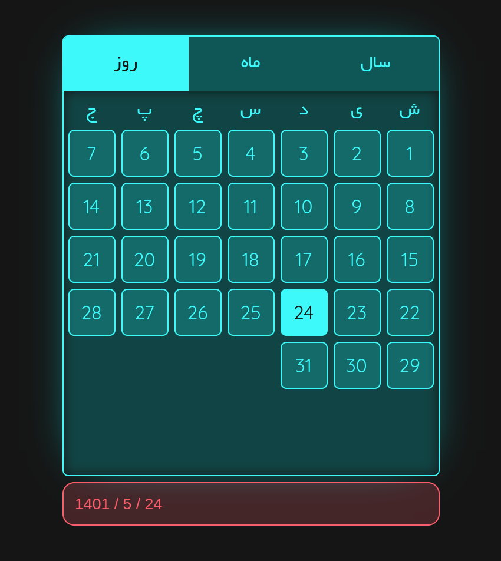

# In the name of kindly generous ALLAH
# Thanks ALLAH

## Datepicker (Jalali / Shamsi)



## How to use
You can use it with has its modules, and 
just pass to your html and use 😄 input

```html
<input class="abol-date-picker"/>
```

> Note! : you must exactly the same name of class in your inputs!

## Customize style
You can customize your custom style sass-es in the path [*sass/date-picker.sass*](sass/date-picker.sass) aor colors in path [*sass/colors.sass*](sass/colors.sass)

## Fonts
> fa : Yekan font used from [github](https://github.com/ParsMizban/Yekan-Font.git)

> en : Quicksand

## Vite
The project uses the Vite build system for now 

## Install
1. clone the git repo and move to datePickerJs
```shell
git clone https://github.com/abol313/Ighamat24-training

cd Ighamat24-training/datePickerJs
```

2. install js dependencies specified in the [package.json](package.json)
```shell
npm install
```

3. You are ready to use a sample now with build it (from vite)

you can now run in development mode 😃
```
npm run dev
```
